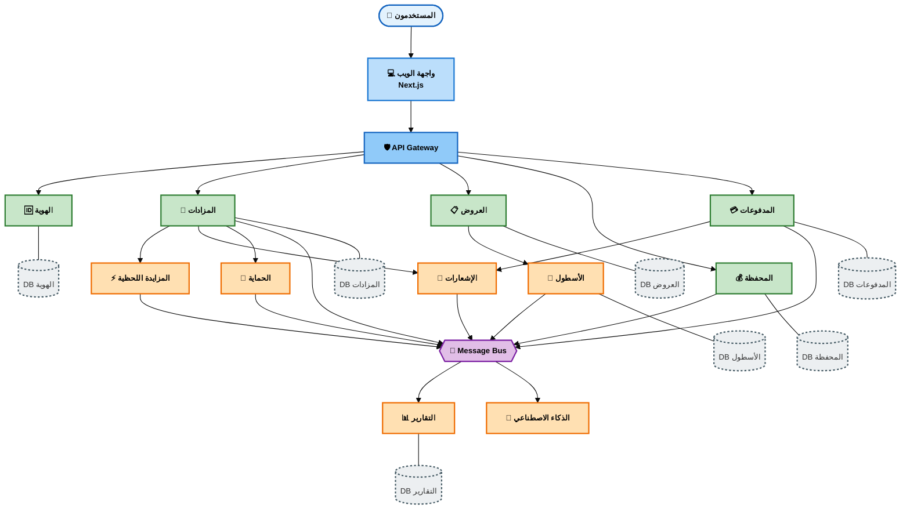

# مخطط معماري DASM-e - نسخة مبسطة للطباعة

## تعليمات الطباعة:

1. افتح الملف في محرر يدعم Mermaid (VS Code مع إضافة Mermaid)
2. اضغط بزر الماوس الأيمن على المخطط واختر "Export Diagram"
3. اختر PNG أو PDF
4. للطباعة على A4:
   - استخدم وضع Landscape (أفقي)
   - أو Portrait مع Scale: 80-90%

