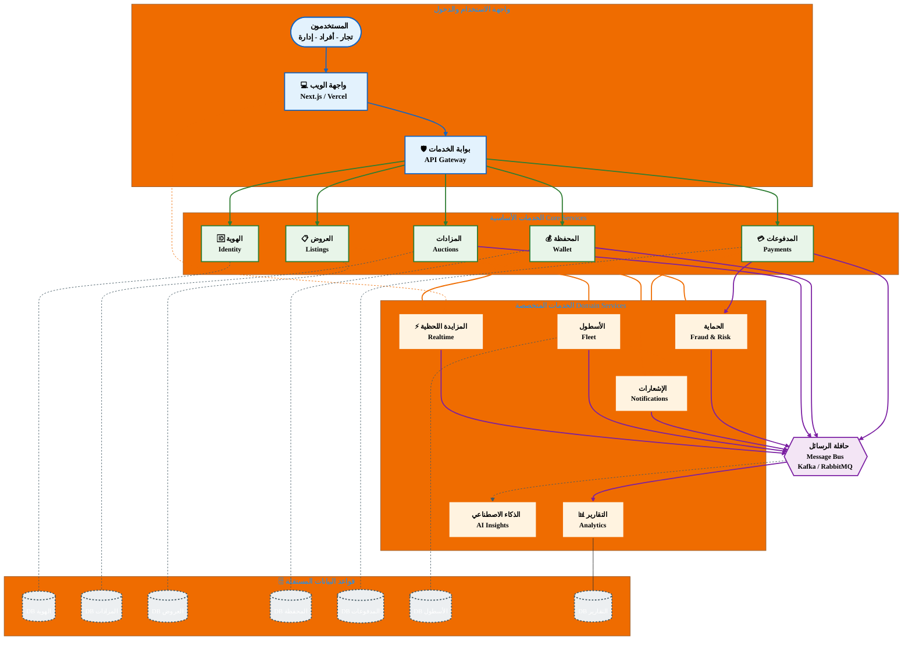

# مخطط معماري لمنصة DASM-e

## ملاحظات للطباعة:

1. **للطباعة على A4:**
   - استخدم وضع Landscape (أفقي) للحصول على مساحة أكبر
   - أو استخدم وضع Portrait (عمودي) مع ضبط المقياس

2. **للتحسين:**
   - يمكنك تصدير المخطط كصورة PNG أو PDF من أي محرر يدعم Mermaid
   - أو استخدم أدوات مثل: Mermaid Live Editor, Draw.io, أو VS Code مع إضافة Mermaid

3. **الألوان:**
   - 🔵 أزرق: واجهة المستخدم
   - 🟢 أخضر: الخدمات الأساسية
   - 🟠 برتقالي: الخدمات المتخصصة
   - 🟣 بنفسجي: حافلة الرسائل
   - ⚫ رمادي: قواعد البيانات

