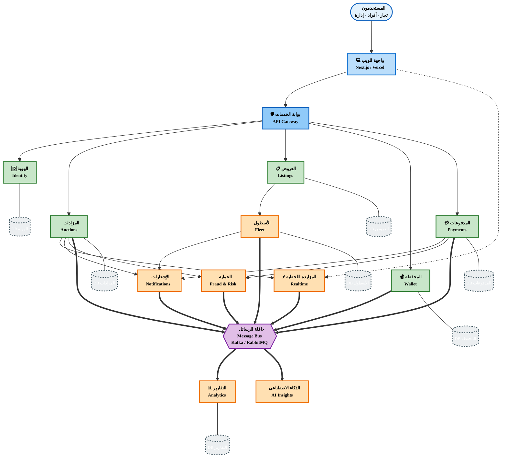

# مخطط معماري DASM-e - نسخة قابلة للطباعة على A4

## تعليمات الطباعة على A4:

### الخطوة 1: تصدير المخطط
1. افتح: https://mermaid.live
2. انسخ محتوى المخطط أعلاه
3. الصقه في المحرر
4. اضغط "Actions" → "Download PNG" (اختر دقة عالية: 1920x1080 أو أعلى)

### الخطوة 2: الطباعة
1. افتح الصورة المصدرة
2. في إعدادات الطباعة:
   - **الورق**: A4
   - **الاتجاه**: Landscape (أفقي) - موصى به
   - **المقياس**: Fit to Page أو 100%
   - **الجودة**: عالية (High Quality)

### بديل: استخدام PDF
1. في Mermaid Live Editor: "Actions" → "Download SVG"
2. افتح SVG في متصفح أو محرر صور
3. اطبع كـ PDF
4. اطبع PDF على A4

## مفتاح الألوان:

| اللون | المعنى |
|------|--------|
| 🔵 أزرق فاتح | واجهة المستخدم |
| 🔵 أزرق | بوابة الخدمات |
| 🟢 أخضر | الخدمات الأساسية (Core) |
| 🟠 برتقالي | الخدمات المتخصصة (Domain) |
| 🟣 بنفسجي | حافلة الرسائل |
| ⚫ رمادي | قواعد البيانات |

